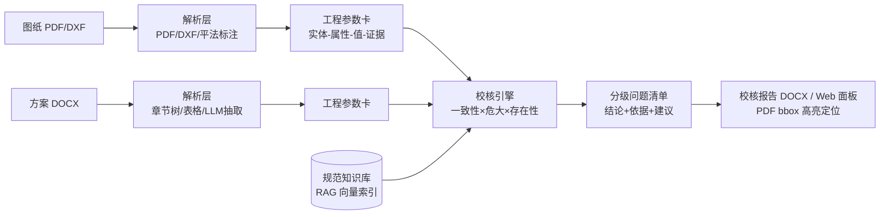

# 施工图 × 施工方案 协同智能校核系统

> 面向土建施工场景的 AI 校核工具：把施工图（PDF/DXF）与施工方案（DOCX）各自解析为**可溯源的"工程参数卡"**，自动执行 **一致性比对 / 危大工程识别 / 方案合规检查**，输出每条带证据定位的校核报告（DOCX）。

[]() []() []() [](https://github.com/yuluo554/construction-drawing-plan-checker#开发方式)

## 为什么做这个

施工图在 CAD/PDF 世界，施工方案在 Word 世界，"两张皮"导致：

- **关键参数易错**：混凝土强度、支撑高度等在两套文档间不一致；
- **校核靠人工**：技术员逐页翻图对照方案，效率低、易漏项；
- **危大管控薄弱**：方案是否达到"危大工程/超规模（须专家论证）"阈值，全凭经验。

本系统把两侧文档统一解析为结构化参数卡，用 **规则引擎 + RAG 规范库双通道** 自动校核——结论每条可溯源（图纸 bbox 坐标 / 方案章节原文），LLM 只做兜底与摘要，数值结论全部来自确定性规则，杜绝幻觉进报告。

## 核心特性

- 📐 **图纸解析**：矢量 PDF / DXF，平法标注（22G101 梁/柱/板）专用解析器，输出带 bbox 坐标的构件参数卡
- 📄 **方案解析**：章节树 + 表格键值 + LLM 结构化抽取（每值必须回溯原文，防幻觉校验）
- ⚖️ **一致性校验**：别名归一（砼→混凝土）、单位换算（m↔mm）、多值消歧、冲突分级（致命/一般/提示）
- 🚨 **危大合规**：住建部令 37 号 / 建办质〔2018〕31 号附件阈值表驱动，自动判定"危大 → 专项方案"、"超规模 → 专家论证"
- 📚 **规范 RAG**：48 号指南 + 危大清单向量化检索，致命项自动附条文依据
- 📝 **报告导出**：分级问题清单（双侧证据 + 条文依据）+ 签署栏的 DOCX 报告
- 🖥 **Web 界面**：上传即校核，PDF 证据红框高亮定位，报告一键下载

## 架构



## 快速开始

环境要求：Python 3.8+（推荐 3.10），可选大模型 API（阿里云百炼等 OpenAI 兼容接口）。

```bash
git clone https://github.com/yuluo554/construction-drawing-plan-checker.git
cd construction-drawing-plan-checker/code/backend
pip install -r ../requirements.txt

# 方式一：Web 界面（推荐）
uvicorn app.server:app --port 8000        # 打开 http://127.0.0.1:8000

# 方式二：CLI 端到端
py -m app.cli run ../../data/施工图纸/自制样例/sample_beam_plan.dxf \
                  ../../data/施工方案/自制样例/sample_formwork_plan_13.docx \
                  -o ../../输出 --rag

# 运行测试（26 项，零 API 依赖）
pytest tests/ -q
```

可选 LLM：复制 `code/.env.example` 为 `code/.env`，填入 API Key 后加 `--llm` 开关启用 LLM 抽取与兜底（规则命中不耗 API）。

## 基准与评测（内置可复现）

```bash
cd code/backend
py tools/bench_drawings.py 30 1        # 图纸解析：30 张随机图纸 vs 真值
py tools/bench_consistency.py 15 1     # 配对校核：15 组植入已知差异的图纸+方案
py tools/build_kb.py                   # 重建规范知识库（需 API Key）
```

| 评测项 | 结果 |
|--------|------|
| 图纸解析（30 张随机图 / 876 字段） | **P = R = F1 = 1.00**（0 误报 0 漏报） |
| 方案 LLM 抽取（8 万字真实方案 / 1341 候选行） | 202 条抽取，**5 条幻觉拦截**，0 失败 |
| 配对一致性校核（15 组植入差异） | **植入差异检出 7/7，危大判定 15/15，误报 0** |
| 危大阈值判定（基坑/模板/脚手架边界用例） | 分级全对 |
| 规范检索（5 类问题 × 55 条文块） | top1 全命中（0.55–0.80） |

## 目录结构

```
├── plan/            设计文档（需求分析/架构/模块设计/数据计划/里程碑）
├── data/            样例数据与知识库（台账见 data/README.md）
│   ├── 施工图纸/    FloorPlanCAD 抽样 + 程序化自制平法图纸（带真值）
│   ├── CAD样例/     LibreDWG / ezdxf 官方样例
│   ├── 法规标准/    建办质〔2021〕48号编制指南（官方 docx）+ 危大阈值清单 JSON
│   └── 施工方案/    高支模真实方案样例 + 程序化自制方案（可植入已知差异）
├── code/
│   ├── backend/     解析器 / 参数卡 / 规则引擎 / RAG / Agent 编排 / 报告导出 / Web 服务
│   ├── rules/       校核规则库元数据
│   └── knowledge/   规范条文向量索引
└── tests            → code/backend/tests（26 项单元/集成测试）
```

## 数据说明

- 自制数据由 `code/backend/tools/gen_sample_*.py` 程序化生成，参数随机可复现，**带真值 JSON**，可低成本扩充到任意规模；
- 开源数据：FloorPlanCAD（Apache-2.0）、LibreDWG / ezdxf 官方样例；
- 法规文件来自中国政府网公开发布（建办质〔2021〕48号），阈值清单为机器可读整理版，使用前请与官方文本核对；
- 高支模方案样例来自公开仓库 CallStorm/SmartReview，含真实项目信息，二次使用请注意脱敏。

## 已知限制

- 扫描版（图片型）图纸需 OCR 通路（预留接口，未在本原型实现）；
- DWG 需先用 ODA File Converter 转 DXF（转换未集成自动化）；
- 规范库当前仅覆盖危大管理文件族，JGJ 130 等技术规范条文待扩充；
- 危大判定按参数阈值，不替代专家论证等法定程序。

## 开发方式

本项目由 **[yuluo554](https://github.com/yuluo554)** 与 **ZCode（AI 编程智能体）** 协作完成：需求解读、架构设计、评测把关与发布由人主导；解析器编码、基准构建、文档生成等由 ZCode 按本文档的方法论执行（提交记录含 `Co-authored-by: ZCode` 署名）。

## License

[MIT](LICENSE)
